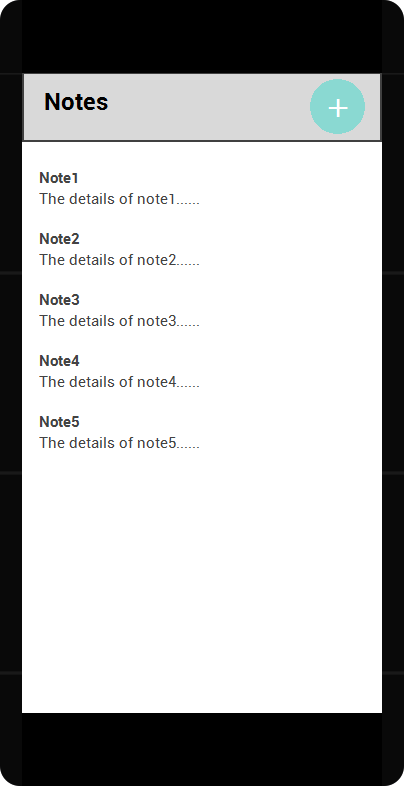
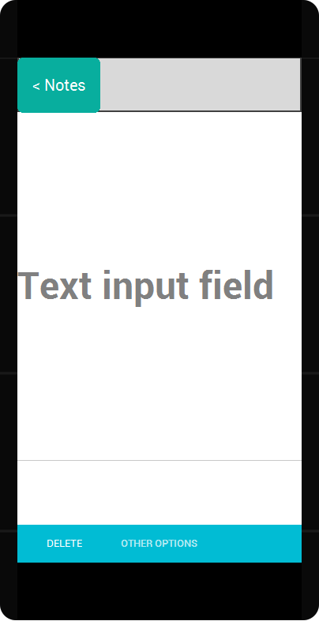
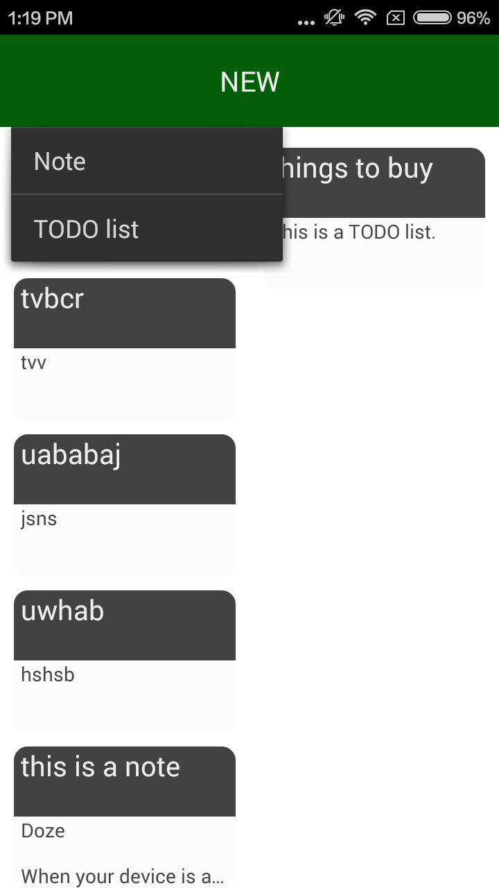
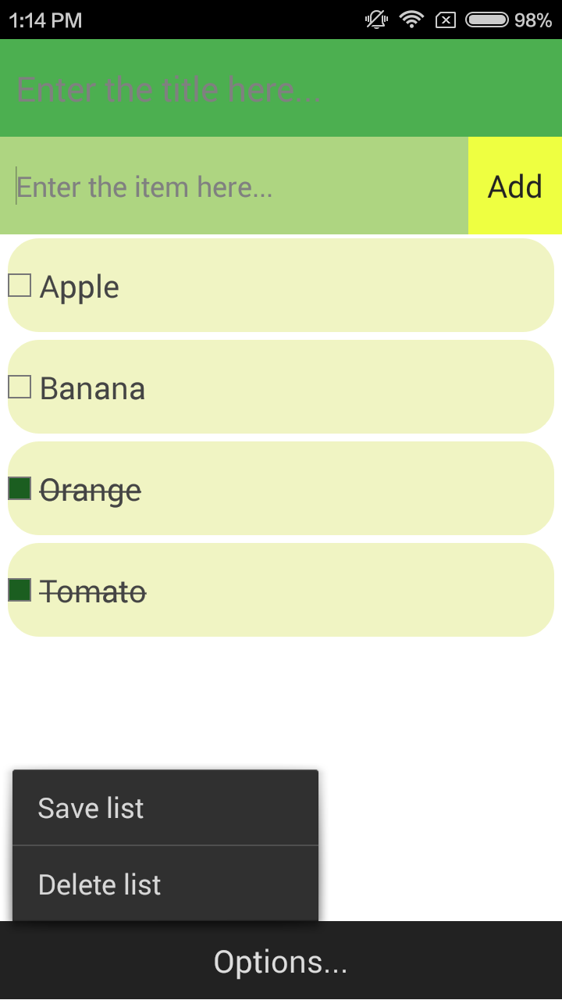

#  Android App - 'Notes' by Liyang(Leon) Guan - u5684206

## __1 DESIGNS__  

### 1.1 Initial UI design  
   
The basic version of the user interface composed by 2 activities:   
     

  
### 1.2 Initial UML design  

The basic version of the UML diagram:     
    

### 1.3 Final UI design  
    
The Main Activity:   
     

The Note Edit Activity:
    

The Todo List Activity:  
    

   
### 1.4 Final UML design    
    
The UML diagram:    
   
   
  
  
  
## __2 TESTS__  
  
### 2.1 Reasons to lacking of tests in code
  
Due to the following reasons I did not actually write tests in my code:  
* I did not use any Object in my final design. (I can't test the consistency of objects).  
* I can not configure the Espresso. More specially, can not resolve 'AndroidJUnit4.class'.   
  
### 2.2 Manual Testing Summary  
   
Here is my manual testing summary:  
   
1. The consistency of storing a note.  __[Checked]__  
2. The consistency of storing a todo list.  __[Checked]__  
3. The consistency of showing a note/list in mainActivity.  __[Checked]__  
4. The functionality of 'NEW' button in mainActivity.  __[Checked]__
5. The functionality of click an item to open in mainActivity.  __[Checked]__  
6. The functionality of 'Options...' button in editActivity along with 3 options inside of it.  __[Checked]__    
7. The functionality of 'DELETE' / 'EDIT' buttons in editActivity.  __[Checked]__  
8. The functionality of 'Add' button in todoActivity.  __[Checked]__  
9. The functionality of long press on a entry to delete.  __[Checked]__  
10. The functionality of 'Options...' button in todoActivity along with 2 options inside of it.  __[Checked]__  
  
  
  

